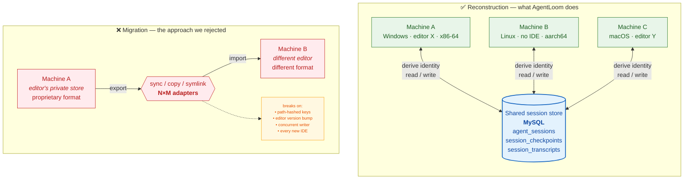
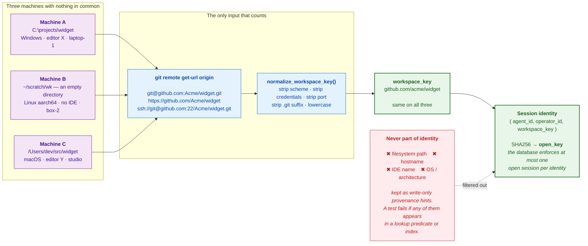
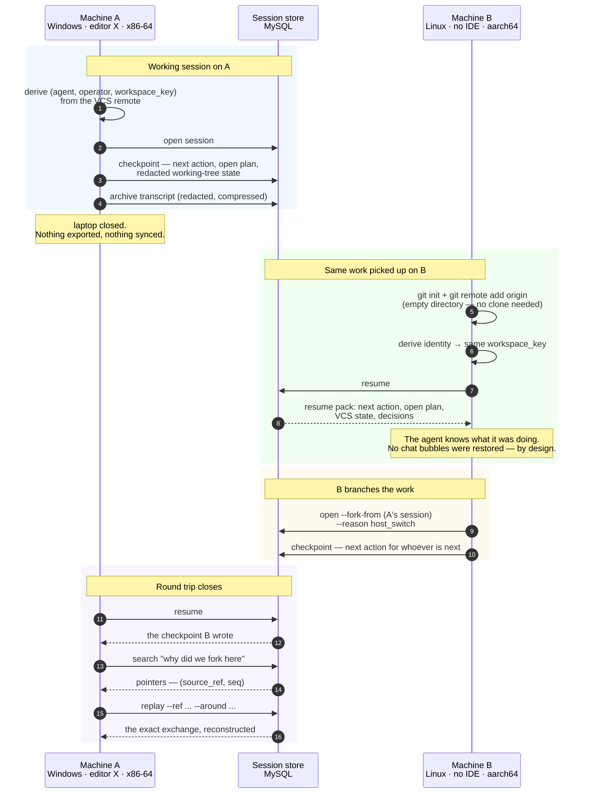
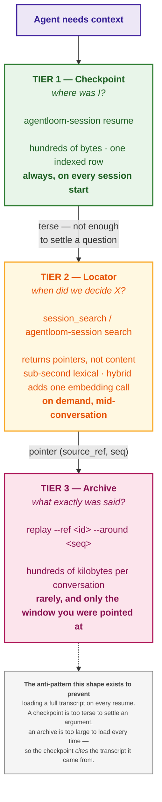
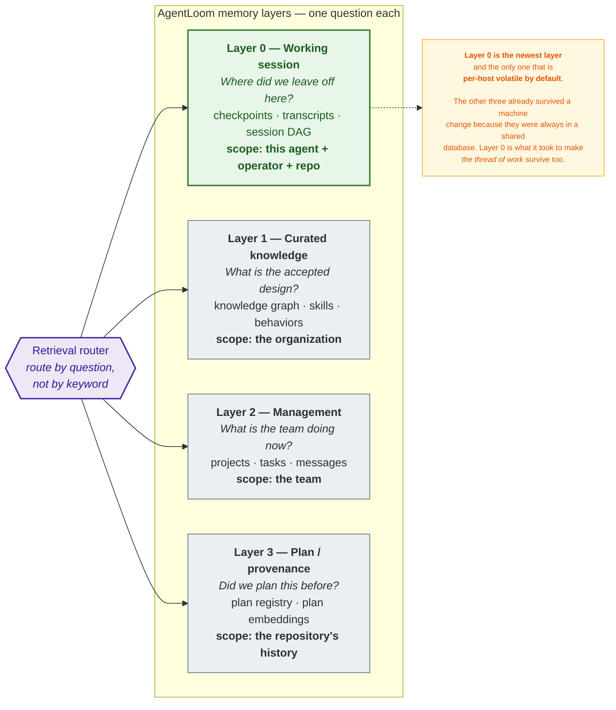

# AgentLoom Memory Reconstruction

**Status:** Reference architecture — describes the shipped `agentloom_runtime.session` module
**Part of:** AgentLoom Runtime
**Companion:** [`layer-0-session-memory.md`](layer-0-session-memory.md) — that document is the *contract* (invariants, data model, CLI surface). This one is the *mechanism*: why it is shaped this way and what actually happens when an agent moves between machines.

---

## The question

An agent works with you on Windows in the afternoon. That evening you open the
same repository on a Linux box that has no IDE installed at all. The agent
should know what it was doing.

Everything else already survives that move. The code is in Git. The knowledge
graph, the task database, and the plan registry are in a shared MySQL instance,
so they were never tied to a laptop in the first place. The single thing that
does not survive is *the thread of work* — which is, inconveniently, the thing
you need first.

The obvious fix is to move the editor's session data to the other machine. That
is the wrong shape, and understanding why is most of the design.

---

## 1. Reconstruction, not migration




**Migration** treats session state as a *payload* that must be carried from one
host to another. It fails for two independent reasons, either of which is
sufficient.

The first is combinatorial. Every editor stores conversations in its own private
format, so migration needs an adapter for each pair of hosts you care about —
N×M, growing quadratically, and every one of them breaks when either vendor ships
a release. Supporting a new IDE means writing new code.

The second is that those stores are hostile to external writers. They are keyed
by a hash of the *absolute workspace path*, so the same repository at
`C:\projects\x` and `/home/dev/x` is already two different keys before anything
crosses the network. The running editor caches them in memory rather than
re-reading from disk, so a concurrent external write is either ignored or
corrupts the file. Building durable memory on top of a private store you do not
control means your memory system's uptime is capped by someone else's release
notes.

**Reconstruction** inverts the direction. Nothing is carried between machines.
Each machine independently *derives* the same identity from information both
machines already have — the repository itself — and then reads the state that
belongs to that identity out of a shared database. There is no transfer step to
break, and supporting a new host costs a bootstrap instruction rather than an
adapter. The cost is linear in hosts, not quadratic in host pairs.

> **The principle:** never transfer identity, derive it. Two machines that can
> compute the same key from the same repository do not need to talk to each other.

---

## 2. How identity is derived




The VCS remote is the one fact about a workspace that is identical everywhere
and that nobody has to configure. Every transport for the same repository —
SSH, HTTPS, `ssh://` with an explicit port — normalizes to a single key, so a
checkout at `C:\projects\widget` and one at `~/scratch/wk` are recognized
as the same workspace.

Two consequences are worth stating explicitly because they are what make the
design work in practice.

**A workspace does not need to be a real checkout.** Identity comes from the
remote URL and nothing else, so an empty directory with `git init` and
`git remote add origin` is a sufficient workspace. This is how a headless
machine with no clone of the repository can still resume the session — and it is
the sharpest available test that no filesystem state leaked into the key.

**The excluded fields are the load-bearing part.** Hostname, IDE name, OS,
architecture, and absolute path are all recorded, but only as write-only
provenance. If any of them entered a lookup predicate, everything would still
work perfectly on the machine that wrote the row and silently return nothing
everywhere else — the worst failure mode available, because it passes every test
run on one machine. That is why it is enforced by a test
(`tests/test_session.py`) rather than by convention.

A directory with no remote falls back to `local:<directory-name>`, which still
matches across machines when the folder name matches. Usable, but prefer a real
remote.

---

## 3. What actually happens across two machines




Note what is absent between the first phase and the second: there is no export,
no sync, no handshake between A and B. A wrote to the database and closed its
laptop. B computed the same key and read.

The fork in the third phase is what makes the topology a DAG rather than a
chain. When B picks up work that A started, it records `parent_session_id` and
`fork_reason`, so the history keeps the branch structure instead of flattening
it into one confusing linear stream. `agentloom-session tree` renders the shape
directly, rather than requiring a diagram of it:

```text
● 8f2a1c…  cross-host session                 [parked]  laptop-1 / editor X
└── ● 3d9e77…  continued after host switch    [open]    box-2 / none
        fork_reason: host_switch
```

The host and editor shown per node come from the provenance hints — useful for
reading the history, never consulted when looking a session up.

The final phase is the part people find surprising: **A can read what B wrote.**
Continuity is not one-directional "move my work to the new laptop"; both
machines are peers against the same store. That round trip is what a deployment's
remote-host acceptance test asserts, over SSH, against a genuinely different OS
and CPU architecture.

---

## 4. Three tiers, separated by cost




The three tiers answer the same subject — *what happened before* — and differ
only in cost. That is deliberate, and it is the difference between a memory
system that gets used and one that gets disabled for being slow.

A checkpoint is a few hundred bytes and is loaded unconditionally at every
session start. It is far too terse to settle an argument about a past decision,
which is exactly why the archive exists. The archive is a few hundred kilobytes
per conversation and would be absurd to load on every resume, which is exactly
why the checkpoint exists. The locator bridges them by returning *pointers* —
`(source_ref, seq)` — so the agent pages in one window of one conversation
rather than the whole thing.

Each checkpoint cites the transcript it was derived from, so any tier-1 answer
can be expanded into a tier-3 answer on demand. The ladder is navigable in both
directions.

The locator indexes prose only — human and agent text, never tool-call noise —
at two granularities: one node per session, plus overlapping turn windows.
Ranking is hybrid lexical + vector RRF. Time is a filter (`--since`), not
something cosine similarity is asked to encode.

---

## 5. Where this sits in the memory stack




Layer 0 is numbered zero because it comes first in time, not because it is the
foundation of the others. It is the layer you touch at the start of every
session, before you know which of the other three you will need.

It is also the only layer that was ever host-local. Layers 1–3 were in a shared
database from the beginning, which is why moving machines never lost the
knowledge graph or the task list. Reconstruction is the work of bringing the
last layer up to the same standard.

The boundary matters in the other direction too. A checkpoint is **overwritten
by the next checkpoint** — it is a resume pointer, not a record. Putting a
durable decision in one is a mistake; it belongs in the curated KG (Layer 1) or
a plan (Layer 3). The locator finds where a decision was *discussed*; it does not
become the authority on what was *decided*.

| Question | Layer |
|---|---|
| Where did we leave off in this repository? | **Layer 0** — checkpoint |
| When did we decide X? | **Layer 0** — locator, then replay |
| What is the accepted design? | Layer 1 — curated knowledge |
| What is the team doing now? | Layer 2 — management |
| Did we plan this before? | Layer 3 — plan / provenance |

---

## 6. What to verify in a deployment

Architecture documents describe intent. A deployment should be able to
*measure* whether the intent holds, because every property below has a failure
mode that leaves the system looking healthy.

Absolute numbers depend on your corpus size, database, embedding provider, and
network, so none are given here. What transfers is the list — and the reason
each item is on it.

| Property to check | The silent failure it catches |
|---|---|
| A resume returns a checkpoint written by a **different** host | The claim is cross-host continuity. If only one machine ever wrote, nothing has been proven — everything works on the machine that wrote it. |
| Search actually reaches hybrid mode | If the embedding provider is unreachable or unconfigured, hybrid search degrades to lexical **and still returns plausible results**. Nothing errors; recall just quietly gets worse. |
| Every chunk has an embedding, from exactly **one** model | Partial coverage silently drops rows from vector ranking. Mixing models is worse: the vectors are not comparable, so scores are meaningless rather than absent. |
| Every archived transcript is indexed | Archive and index are separate steps. If only the first is scheduled, conversations are stored but unfindable. |
| The archive is fresh | A scheduled capture job that dies leaves a store that looks fine and stops growing. Compare newest archived conversation against wall-clock. |
| Vectors decode, none are zero-norm, blob length matches the stored dimension | Encoding bugs and truncation produce vectors that still *have* a cosine similarity — just the wrong one. |
| Index size against the content it indexes | A ratio that drifts upward means the index is becoming the dominant cost. Worth a decision before it is a bill. |
| Search latency, tracked over time | This matters as a **slope**, not a reading. Lexical ranking is a linear scan: comfortable at ten thousand chunks, not at fifty thousand. A single measurement cannot tell you which side of that you are on. |

The last row generalizes: run these checks periodically and keep the results,
rather than checking once at deployment. A single run tells you the system is
healthy now; a sequence tells you the direction, and the direction is what
decides when to act.

The audit itself belongs in your deployment repository rather than in this
library, because the queries are necessarily shaped by your schema and your
operational thresholds. Two properties are worth copying from any
implementation of it: make it strictly read-only — an audit tool that can
modify what it audits is a source of incidents — and have it report exact
counts rather than `information_schema` row estimates, which are approximate
for InnoDB and can be off by a factor of two.

---

## 7. What this deliberately does not do

It does not restore native chat bubbles in the target editor's own sidebar. That
is the one capability that requires writing a host's private chat store, and it
is refused for the reasons in §1.

The trade-off is narrower than "no chat history", which is the usual
misreading. The conversation itself moves — captured, redacted, compressed,
stored, searchable, and replayable on any machine. What does not move is its
*rendering inside one vendor's UI widget*. You read it with `replay` or in the
web viewer instead of by scrolling a sidebar.

Everything else on the anti-pattern list follows from the same commitment:
no symlinking editor application-data directories, no keying a session on an
absolute checkout path, no filtering a resume lookup on a machine name, no
requiring an editor extension for any operation.

The same argument applies one layer down. Derived archive state — a translated
turn, a listing title, a reviewer's score — is still Layer 0. If it lives in a
file beside the checkout, switching machines drops it. Overlays go in
`presentation_json`; locator rows are keyed by `locale`; batch progress and
judgement go in `session_job_*`. The deployment-repo specification is
`docs/architecture/memory/layer-0-archive-presentation-and-job-trace.md`.

---

## Related

- [`layer-0-session-memory.md`](layer-0-session-memory.md) — the Layer 0 contract: host-neutrality invariants, data model, host adapter conformance checklist.
- [`three-layer-memory-architecture.md`](three-layer-memory-architecture.md) — layers 1–3 and the retrieval router.
- [`kg-sync-and-maintenance.md`](kg-sync-and-maintenance.md) — the file → database sync contract for curated knowledge.

### Reproducing the diagrams

Diagrams are inline Mermaid so this document stays a single portable file with
no binary assets. Rendered PNG exports (for slides or papers) can be produced
with:

```bash
npx -p @mermaid-js/mermaid-cli mmdc -i diagram.mmd -o diagram.png -b white -s 2
```
